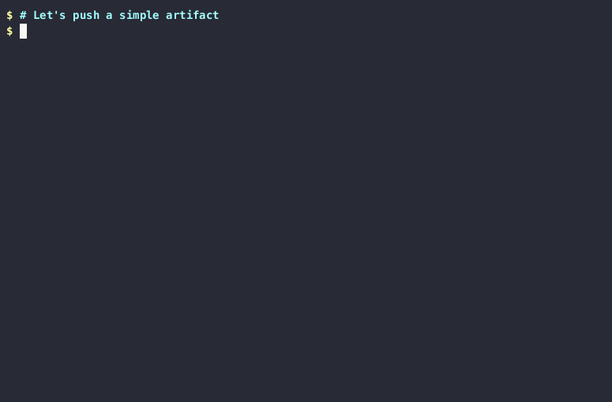

# Notation Demos

The repository contains demos for [Notation](https://github.com/notaryproject/notation) CLI of the Notary Project. 

## Running the demos

### Prerequisites

- [docker](https://docs.docker.com/get-docker/)
- [oras](https://oras.land/docs/how_to_guides/installation)
- [pv](https://ss64.com/bash/pv.html)
- [jq](https://stedolan.github.io/jq/)

The demo requires an OCI registry. For this we use zot registry.
The registry is run as container and the network is created between the notation-demo image and the demo-registry container.

To avoid passing --plain-http flags and other --insecure flags, the notation-demo container runs socat to forward the traffic to the registry container from localhost.



## Setup

Run the setup script that will help start a local registry and run it in the docker network call `notation-network`. 

```bash
./setup.sh
```

## Cleanup

Reset your environment by removing the demo registry and the docker network.

```bash
./reset.sh
```

For a quick reset and setup run the following command.

```bash
export DEMO_AUTO_RUN=true DEMO_RUN_FAST=true 
./reset.sh && ./setup.sh
```

NOTE: The `DEMO_AUTO_RUN` and `DEMO_RUN_FAST` environment variables are used by the demo scripts to run the demo without user input and to run the demo without waiting for the user to press enter. Unset these variables to run the demo in interactive mode.

## Credits

The demo is based of @thockin's [micro-demos]

[micro-demos]: https://github.com/thockin/micro-demos